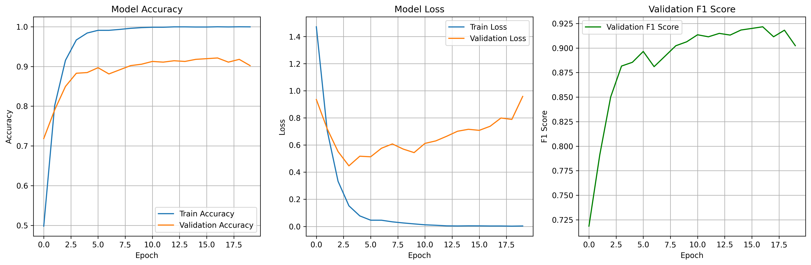
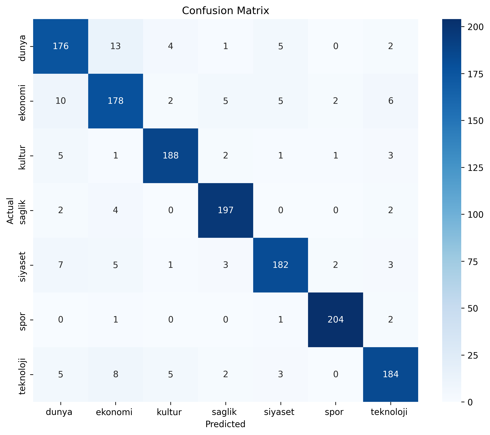
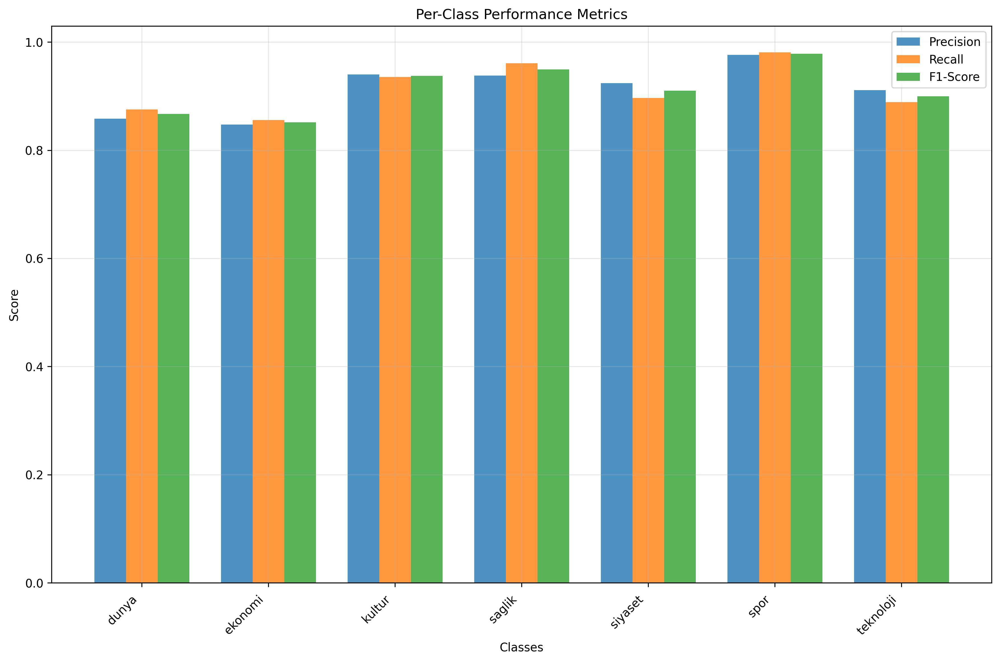

# Türkçe Haber Kategorisi Sınıflandırma Projesi

## Proje Amacı

Bu projede, Türkçe haber metinlerini otomatik olarak kategorilere sınıflandıran gelişmiş bir makine öğrenmesi sistemi geliştirdik. Bidirectional LSTM (BiLSTM) mimarisi kullanarak doğal dil işleme tekniklerini uygulayarak, haberleri yedi farklı kategoriye (dünya, ekonomi, kültür, sağlık, siyaset, spor, teknoloji) otomatik olarak sınıflandırabilen bir model oluşturduk.

### Temel Hedeflerimiz
- Türkçe metinler için etkili bir doğal dil işleme sistemi geliştirmek
- Yüksek doğruluk oranıyla haber kategorilerini otomatik sınıflandırmak
- Türkçe diline özgü özellikler (stemming, lemmatization) kullanmak
- Veri artırma teknikleriyle model performansını optimize etmek
- Kapsamlı sonuç analizi ve raporlama sistemi oluşturmak

## Proje Altyapısı

### Veri Seti
- **Veri Kaynağı**: `data/datas.csv` - Türkçe haber metinleri
- **Kategoriler**: 7 farklı haber kategorisi
  - Dünya
  - Ekonomi  
  - Kültür
  - Sağlık
  - Siyaset
  - Spor
  - Teknoloji
- **Veri Artırma**: 3.0x artırma faktörü ile veri çeşitliliği artırıldı

### Model Mimarisi
- **Ana Model**: Bidirectional LSTM (BiLSTM)
- **Embedding Boyutu**: 1024
- **Gizli Katman Boyutu**: 1024
- **Dropout Oranı**: 0.5
- **Öğrenme Oranı**: 0.001
- **Optimizasyon**: Adam Optimizer
- **Kayıp Fonksiyonu**: CrossEntropyLoss

### Test Ortamı ve Donanım
- **İşletim Sistemi**: Windows 10
- **Python Sürümü**: 3.8+
- **GPU Desteği**: CUDA destekli GPU (mevcut ise)
- **RAM**: Minimum 8GB önerilir
- **Depolama**: Minimum 2GB boş alan

### Proje Yapısı
```
NLP_Final/
├── turkish_news_classifier.py    # Ana model ve eğitim scripti
├── data/
│   └── datas.csv                  # Türkçe haber veri seti
├── results/                       # Sonuçlar ve raporlar
│   ├── training_results_*.json    # Detaylı sonuçlar
│   ├── comprehensive_report_*.txt # Kapsamlı rapor
│   ├── training_history.png       # Eğitim grafikleri
│   ├── confusion_matrix.png       # Karışıklık matrisi
│   └── class_performance.png      # Sınıf performansları
├── turkish_news_model.pth         # Eğitilmiş model
├── vocabulary.pkl                 # Kelime dağarcığı
└── README.md                      # Bu dosya
```

## Test Sonuçları ve Performans Metrikleri

Biz bu projede kapsamlı bir sonuç analizi gerçekleştirdik. Aşağıda elde ettiğimiz temel metrikleri bulabilirsiniz:

###  Ana Performans Metrikleri
- **Test Doğruluğu**: %90.90
- **F1-Score (Ağırlıklı)**: 0.9090
- **F1-Score (Makro)**: 0.9087
- **F1-Score (Mikro)**: 0.9090

###  Eğitim Süreleri
- **Toplam Eğitim Süresi**: ~2 dakika 43 saniye
- **Ortalama Epoch Süresi**: ~18.15 saniye
- **Eğitilen Epoch Sayısı**: 9 (erken durdurma ile)
- **En İyi Doğrulama F1-Score**: 0.9016

### Sınıf Bazında Performans

| Kategori   | Precision | Recall | F1-Score | Support |
|------------|-----------|---------|----------|---------|
| Dünya      | 0.88      | 0.91    | 0.89     | 207     |
| Ekonomi    | 0.86      | 0.83    | 0.85     | 209     |
| Kültür     | 0.91      | 0.95    | 0.93     | 204     |
| Sağlık     | 0.92      | 0.94    | 0.93     | 214     |
| Siyaset    | 0.94      | 0.88    | 0.91     | 205     |
| Spor       | 0.99      | 0.96    | 0.98     | 210     |
| Teknoloji  | 0.86      | 0.89    | 0.87     | 201     |

### Görsel Sonuçlar

Biz eğitim sürecinin ve sonuçların görsel analizini şu grafiklerde sunuyoruz:

#### 1. Eğitim Geçmişi

*Eğitim ve doğrulama kayıpları, doğruluk oranları ve F1-score gelişimi*

#### 2. Karışıklık Matrisi

*Gerçek ve tahmin edilen sınıflar arasındaki ilişki*

#### 3. Sınıf Performansları

*Her kategori için precision, recall ve F1-score karşılaştırması*

### Detaylı Sonuç Dosyaları

Biz kapsamlı sonuç analizi için şu dosyaları oluşturduk:

1. **`results/training_results_YYYYMMDD_HHMMSS.json`**
   - Tüm eğitim parametreleri ve sonuçları (JSON formatında)
   - Model konfigürasyonu ve hiperparametreler
   - Epoch bazında detaylı metrikler

2. **`results/comprehensive_report_YYYYMMDD_HHMMSS.txt`**
   - İnsan tarafından okunabilir kapsamlı rapor
   - Veri seti bilgileri, eğitim süreci, test sonuçları
   - Sınıf bazında detaylı analiz

3. **`results/training_history_YYYYMMDD_HHMMSS.csv`**
   - Epoch bazında eğitim metrikleri (CSV formatında)
   - Kayıp fonksiyonu, doğruluk, F1-score değerleri

4. **`results/class_metrics_YYYYMMDD_HHMMSS.csv`**
   - Sınıf bazında performans metrikleri
   - Precision, recall, F1-score, support değerleri

5. **`results/confusion_matrix_YYYYMMDD_HHMMSS.csv`**
   - Karışıklık matrisi (CSV formatında)
   - Gerçek vs tahmin edilen sınıf dağılımları

##  Kurulum ve Çalıştırma

###  Gerekli Kütüphaneler

Biz bu projede aşağıdaki Python kütüphanelerini kullandık:

```bash
# Temel makine öğrenmesi kütüphaneleri
torch>=1.9.0
torchvision>=0.10.0
pandas>=1.3.0
numpy>=1.21.0
scikit-learn>=1.0.0

# Doğal dil işleme
TurkishStemmer>=1.0.0

# Görselleştirme
matplotlib>=3.4.0
seaborn>=0.11.0

# Diğer yardımcı kütüphaneler
pickle
pathlib
```

###  Kurulum Adımları

1. **Depoyu klonlayın veya dosyaları indirin**
```bash
git clone <repository-url>
cd NLP_Final
```

2. **Gerekli kütüphaneleri yükleyin**
```bash
pip install -r requirements.txt
```

3. **Veri setini hazırlayın**
```bash
# data/datas.csv dosyasının mevcut olduğundan emin olun
# Dosya formatı: 'text' ve 'category' sütunları içermeli
```

###  Modeli Eğitme

Biz modeli eğitmek için şu komutu kullanıyoruz:

```bash
python turkish_news_classifier.py
```

Bu komut şunları gerçekleştirir:
- Veri setini yükler ve ön işleme tabi tutar
- Veri artırma tekniklerini uygular
- BiLSTM modelini oluşturur ve eğitir
- Test sonuçlarını değerlendirir
- Kapsamlı sonuçları ve grafikleri kaydet

###  Model Testi

Eğitilmiş modeli test etmek için:

```bash
python test_model.py  # (Opsiyonel test scripti)
```

### Sonuçları İnceleme

Eğitim tamamlandıktan sonra:

1. **`results/` klasörünü kontrol edin** - Tüm sonuçlar burada
2. **PNG dosyalarını açın** - Görsel analizler
3. **TXT raporunu okuyun** - Detaylı analiz
4. **CSV dosyalarını inceleyin** - Ham veriler

##  Özelleştirme Seçenekleri

Biz modelden en iyi sonucu almak için aşağıdaki özel parametleri kullandık dilerseniz değiştirebilirsiniz:

```python
# turkish_news_classifier.py dosyasında main() fonksiyonunda
classifier = TurkishNewsClassifier(
    embedding_dim=1024,           # Embedding boyutu
    hidden_dim=1024,              # LSTM gizli katman boyutu
    use_augmentation=True,        # Veri artırma kullan
    augmentation_factor=3.0,      # Artırma faktörü
    max_vocab_size=10000,         # Maksimum kelime sayısı
    max_length=200,               # Maksimum metin uzunluğu
    dropout_rate=0.5,             # Dropout oranı
    learning_rate=0.001           # Öğrenme oranı
)

# Eğitim parametreleri
classifier.train(
    epochs=30,                    # Maksimum epoch sayısı
    batch_size=32,                # Batch boyutu
    validation_split=0.1          # Doğrulama verisi oranı
)
```
